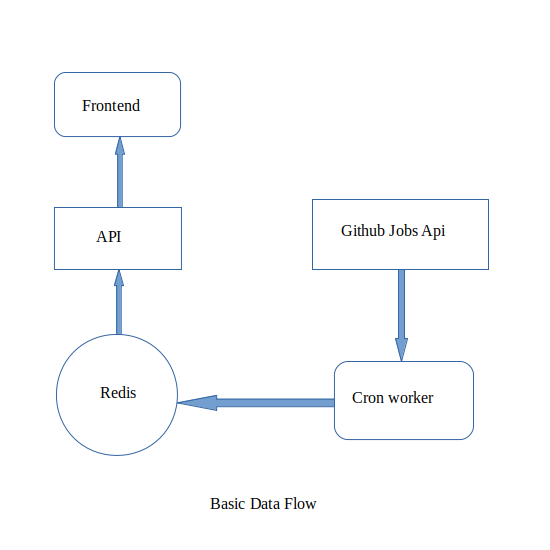

# jr-jobs-feed
Jobs feed for junior developers using react express and redis from github jobs api

## credit
Aaron Jack-Code drip

## requirements
follwing should be installed on computer

<ol>
<li>Nodejs v12</li>
<li>redis-server</li>
</ol>

## local setup
<ol>
<li>In root directory run npm intall</li>
<li>cd client and run npm install</li>
</ol>

## run locally
run express server
```
node api/index.js
```
run cron worker in seperate teminal
```
node worker/index.js
```
finally run client in seperate teminal using command
```
cd client  
npm start
```

## flow of the application

